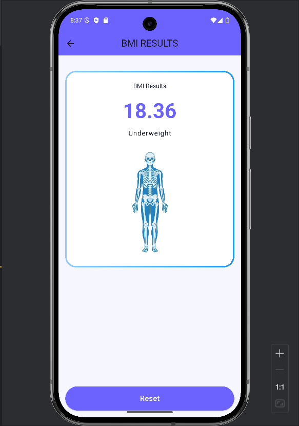
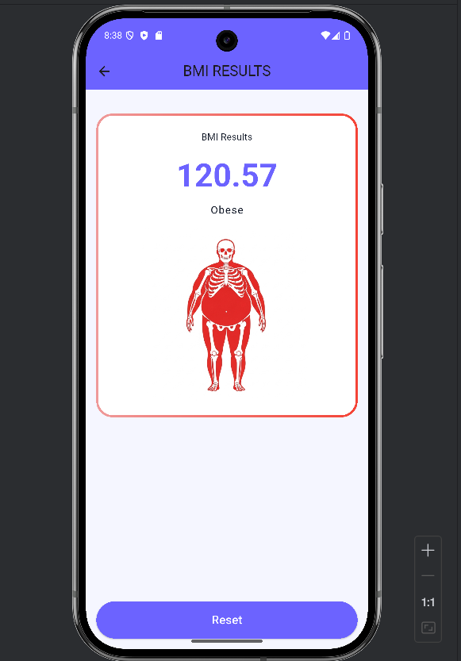
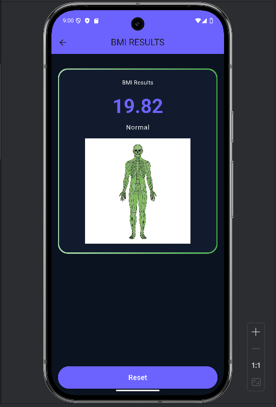

# 🧮 BMI Calculator App (Flutter)
## 🖼️ Screenshots

### Screenshot 1

### Screenshot 2

### Screenshot 3

### Screenshot 4

This is a **BMI (Body Mass Index) Calculator App** built using Flutter as an assignment project.

---

## ✅ Features

- Height slider (cm)
- Weight slider (kg)
- Gender selection (Male / Female)
- Calculate BMI using formula
- Result screen shows:
  - BMI value
  - BMI category
  - Gender + BMI based image
- Reset button
- Dark Mode toggle
- Smooth animations

---

## 🧠 BMI Logic Used

### Formula:

### Implementation:
- Height is taken in **cm**
- Converted into **meters**
- BMI is calculated using arithmetic operations

---

